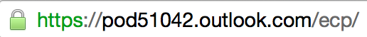
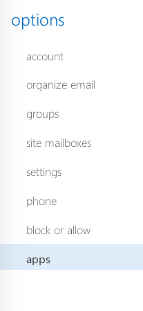

Running Locally
---------------
* clone repo
* run
	```
	npm install
	```
* run
	```
	bower install
	```
* start the local server
	```
	npm start
	```
* setup localhost test addin in Outlook 365
  * Log into OWA
  * Change the url from /owa to /ecp

  

  * Select apps from the options list
  
  * Find the drop down and select Add from File
  

  _If you can't see that setting, you need to request from you outlook admin to enable access to install your own applications._

  * select /config/test.xml


* to change the app that loads instead of a teat page, change this handler in the server to redirect to the page you want to test
  ```
  app.get("/test.html", function(req, res){
      res.redirect("voicemail.html");
  })
  ```
