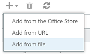

Environment variables
---------------------
**PORT** - The port to run the web server on

**COOKIESTORE** - A secure Id for the cookie

**OAUTHSECRET** - the OAuth Client Secret

**OAUTHIDID** - The OAuth Client Id

**ENV** - The purecloud environment

Testing Locally
---------------
To test locally, make sure that the above environment variables are set and run the rakefile to build and run the web server.  Import test.xml into your outlook account, this will make a request to load test.html.  

In the handlePage method in server.go, there is a line that looks like
```
if fileName == "/test.html" {
	fileName = "/voicemail.html"
}
```
change the fileName to the page you actually want to test and return back to the user.


Running Locally
---------------
* clone repo
* run
	```
	npm install
	```
* run
	```
	bower install
	```
* start the local server
	```
	npm start
	```
* setup localhost test addin in Outlook 365
  * Log into OWA
  * Change the url from /owa to /ecp

  

  * Select apps from the options list
  
  * Find the drop down and select Add from File
  

  _If you can't see that setting, you need to request from you outlook admin to enable access to install your own applications._

  * select /config/test.xml


* to change the app that loads instead of a teat page, change this handler in the server to redirect to the page you want to test
  ```
  app.get("/test.html", function(req, res){
      res.redirect("voicemail.html");
  })
  ```
